# Alpha Platform — Modular Multi-Tenant Content & Commerce Platform

A monorepo (npm workspaces) implementing a type-safe full-stack MERN application:

- **`packages/shared`** — source of truth: Zod schemas, enums, API path constants (imported by both sides).
- **`packages/backend`** — Express REST API, Socket.io realtime, MongoDB (Mongoose), Redis, JWT auth, FSM-driven resources.
- **`packages/frontend`** — React SPA (Vite), TanStack Query, Zustand, Socket.io client.

## Screenshots

Captured from the running app with seeded demo data (real sessions for
every role — customer, provider and admin).

**Public pages**

| Home | Marketplace |
| --- | --- |
| 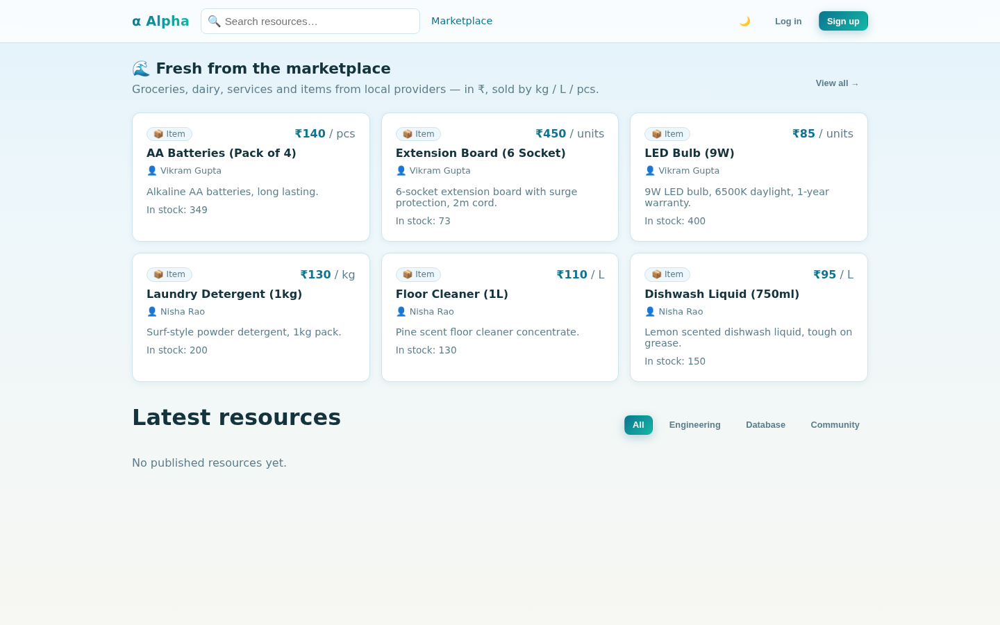 | 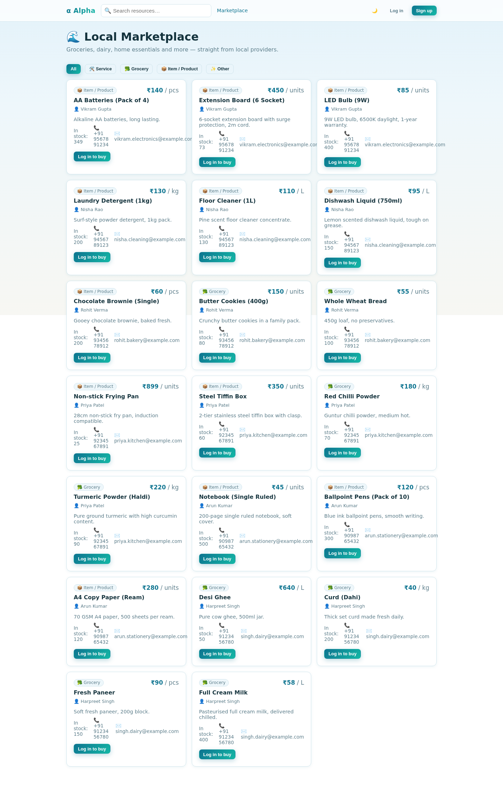 |

| Login | Provider registration |
| --- | --- |
| 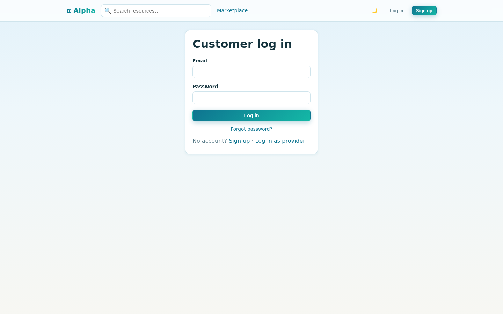 | 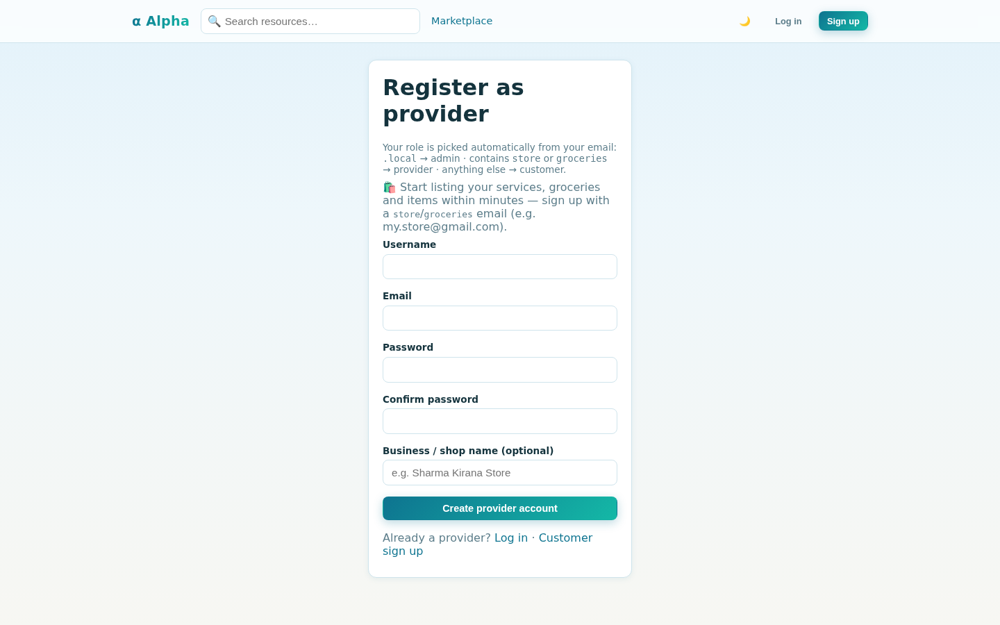 |

**Customer** (dashboard with a real order, cart, delivery timeline, account security)

| Dashboard | Cart |
| --- | --- |
| 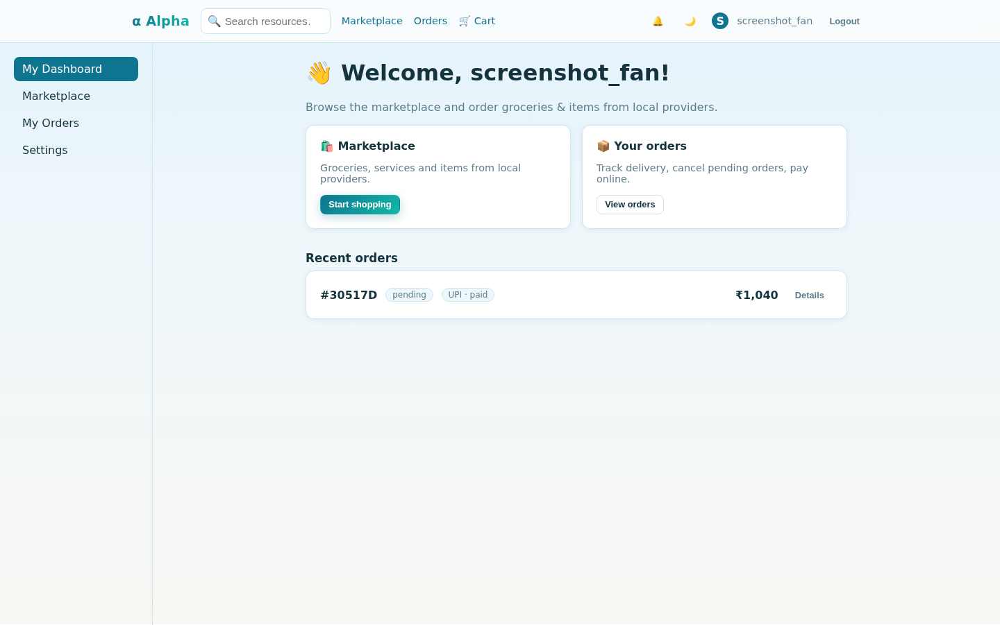 | 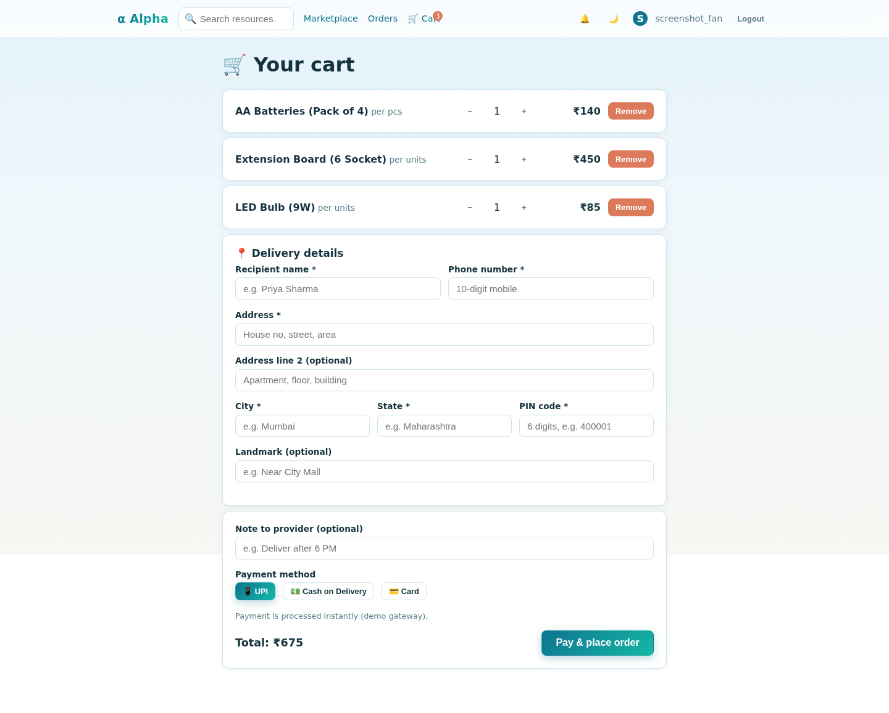 |

| Orders | Settings |
| --- | --- |
| 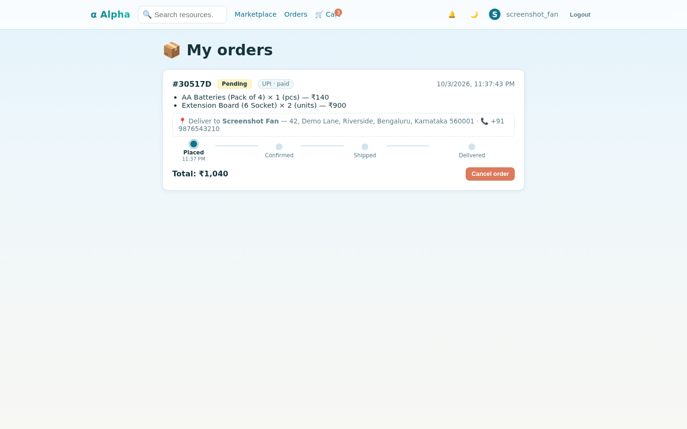 | 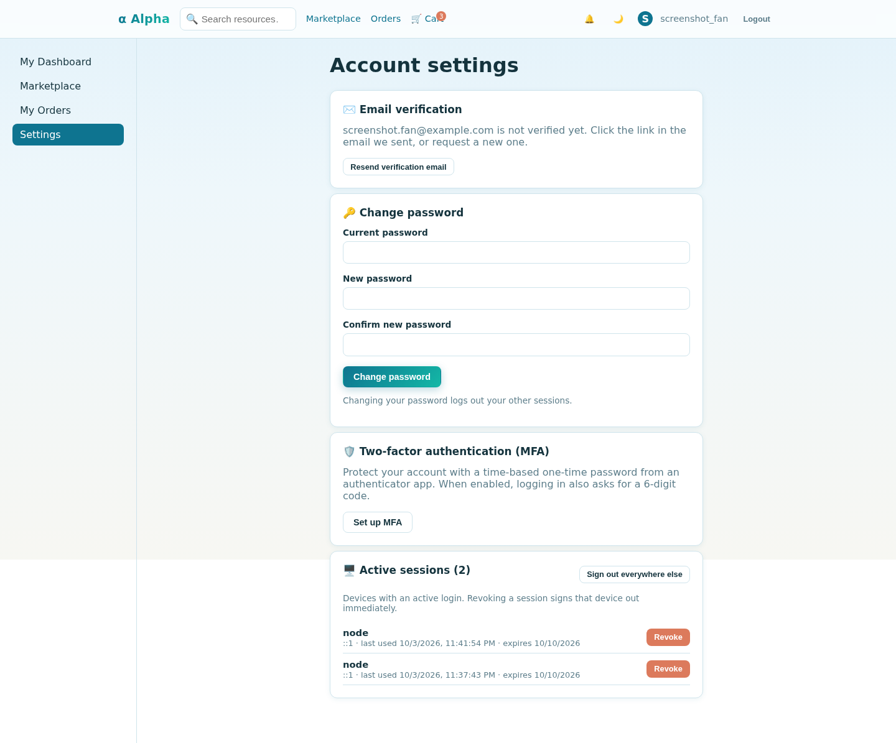 |

**Provider — Provider Studio** (listings, order inbox, exports)

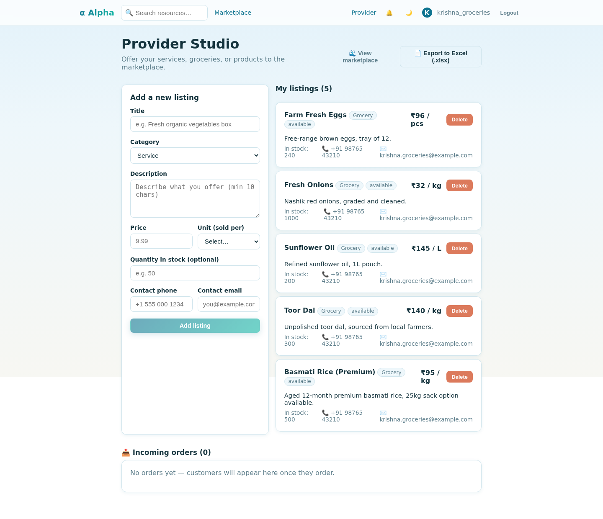

**Admin** (moderation / orders / activity / live security dashboard)

| Admin panel | Security & Monitoring |
| --- | --- |
| 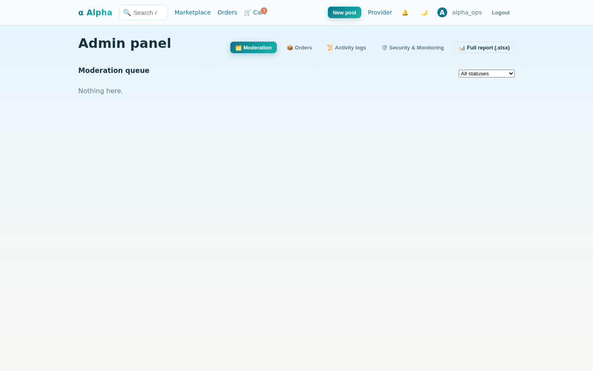 | 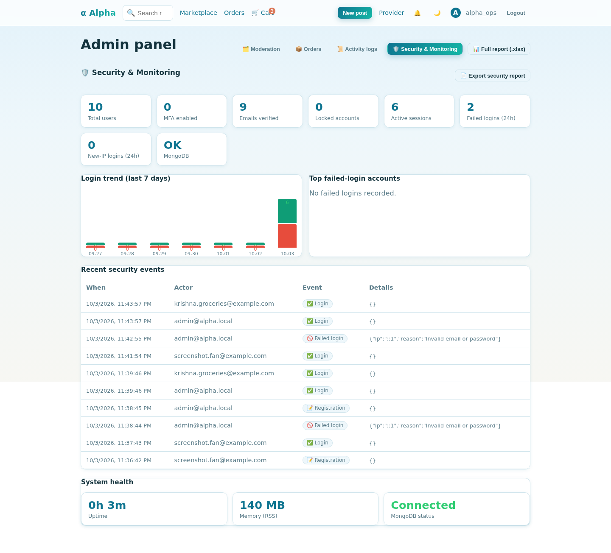 |

## Quick start (development)

```bash
npm install
bash packages/backend/scripts/generate-keys.sh   # generate JWT RSA keypair
npm run dev                                       # builds @alpha/shared, starts API :5347 + SPA :8175
```

Copy `.env.example` to `.env` first and fill in your values. The frontend proxies `/api` to the backend, so no CORS issues in dev.

## Production

```bash
docker compose up --build   # nginx on :8080 routes /api + /socket.io to the backend, / to the SPA
```

Secrets are injected via environment variables / Kubernetes Secrets — never committed.

## Provider marketplace & seed data

The app includes a **Provider Studio** (`/provider`) where providers list services,
groceries and items, and a public **Marketplace** (`/marketplace`) where customers
browse them. Prices are in ₹ (INR) by default with units of kg / L / units / pcs.

Sample providers (8 accounts, 29 listings — groceries, dairy, bakery, electronics…) are
seeded from `packages/backend/seed/provider-catalog.json`:

```bash
npm run seed           # idempotent — safe to re-run
npm run seed:export    # regenerates exports/provider-catalog.xlsx (Providers + Listings sheets)
```

**Deploying with real data:** replace `provider-catalog.json` with your own providers
and listings, then run `npm run seed` against the target database (dev or production).
Providers keep their password on re-runs, so seeded accounts can be created and
handed over to the real providers.

Seeded provider accounts use the password from the catalog file (e.g. `Provider@1234`).
Re-running the seed resets those passwords to the catalog values (the catalog is the
source of truth for demo accounts).

**Separate customer & provider auth:** `/login` + `/register` are for customers;
`/login/provider` + `/register/provider` for providers (with a business-name field).
Providers land in Provider Studio after login.

**Email-driven roles:** at registration the role is assigned automatically from
the email address (server-side, never client-chosen) — `.local` → **admin**,
addresses containing `store` or `groceries` → **provider**, anything else →
**customer**.

**Strict role separation (enforced server-side):**

| Action | Customer | Provider | Member (legacy) | Admin |
| --- | :-: | :-: | :-: | :-: |
| Buy / place orders | ✅ | ❌ 403 | ✅ | ✅ |
| Sell / create listings | ❌ 403 | ✅ | ✅ | ✅ |
| Publish community posts | ❌ 403 | ❌ 403 | ✅ | ✅ |

Customers get a **buyer dashboard** (`/dashboard` — recent orders + marketplace
links), providers get **Provider Studio** (`/provider`), and each role only sees
the navigation for what it can do (providers never see Cart/Orders; customers
never see Provider Studio or New post). Providers can still **browse the
marketplace** (add-to-cart is hidden for sellers; the button is replaced with a
"browsing as a seller" note), and Provider Studio links to the marketplace.

**Orders & payments:** customers add items to the cart (`/cart`), enter **delivery
details** (recipient name, phone, full address, city, state, 6-digit PIN code —
required, validated server-side), pick a payment method (UPI / Cash on Delivery /
Card — demo gateway), and place orders (`/orders`). The delivery address is saved
with the order and shown to the customer, the provider's inbox (so they know where
to deliver), and the admin's order list + Excel export. Stock is decremented
**atomically** (no double-selling) and restored when a pending order is cancelled.
The marketplace auto-refreshes so sold-out items disappear. Providers see incoming
orders in Provider Studio (`/provider`) and can confirm, cancel, or mark orders
paid. Totals are computed server-side in ₹.

**Delivery tracking:** orders move `pending → confirmed → shipped → delivered`
(forward-only, enforced server-side) with a status-history timeline shown to the
customer. **Notifications:** providers are notified (bell + realtime socket) the
moment an order is placed, and customers when it's confirmed, shipped, delivered
or cancelled.

**Admin panel** (`/admin`, admin role only) has four tabs:

- **Moderation** — review resources
- **Orders** — every order with customer, items, ₹ totals, payment, and an
  **Export to Excel** button
- **Activity logs** — an audit trail of registrations, logins, orders, and
  listing changes (filterable by action)
- **Security & Monitoring** — a live security dashboard: adoption metrics
  (MFA/verification/lockouts/sessions), a 7-day login success/failure trend,
  top failed-login accounts (brute-force suspects), recent security events
  (logins, failed logins, new-IP logins, password resets, MFA toggles,
  recovery-code use), system health (uptime, memory, MongoDB), and an
  **Export security report** button (`GET /api/v1/admin/security/export`, 4
  sheets). Auto-refreshes every 30s.

All orders can also be exported from the CLI:

```bash
npm run export:orders    # writes exports/orders-report-<date>.xlsx
```

## Automated Excel reporting

A scheduled job (runs **every hour**, `node-cron`) aggregates the whole platform
into a workbook with 7 sheets — **Resources, Users, Comments, Provider Listings,
Orders, Activity Logs, Analytics** (including revenue) — and writes it to
`reports/report_YYYY-MM-DD_HH-MM.xlsx`. Only the last **10** reports are kept.

The same report is generated on demand when an admin downloads it:

- **Admin panel → 📊 Full report (.xlsx)** button
- or `GET /api/v1/admin/report/download` (admin JWT required)

**Where every Excel file lives:**

| File | How to get it |
| --- | --- |
| `reports/report_*.xlsx` | hourly automated report (admin panel button or the endpoint above) |
| `exports/orders-report-<date>.xlsx` | `npm run export:orders` (all orders + customers) |
| `exports/provider-catalog.xlsx` | `npm run seed:export` (seed catalog) |
| Provider's own listings | Provider Studio → 📄 Export to Excel (server-generated) |
| Activity logs | Admin panel → Activity → 📄 Export logs |

## Security

Built-in controls: helmet security headers + CSP, double-submit-cookie CSRF,
CORS whitelist, rate limiting (global + auth + search, Redis-backed when
available), RS256 JWT with rotating refresh tokens (httpOnly cookie), bcrypt
password hashing, and `sanitize-html` on all rich-text content.

**Account security features:**

- **MFA (TOTP) for every account** — Settings → Two-factor authentication shows a
  QR code (Google Authenticator / Authy). When enabled, login is two-step
  (password → 6-digit code) and the secret is never exposed by the API.
- **Forgot password** — `/forgot-password` emails a **one-time, 1-hour** reset
  link; redeeming it revokes all other sessions. In dev (no SMTP) the link is
  printed in the backend log.
- **Change password** — Settings → Change password, requires the current
  password and logs out other sessions.
- **Email verification** — every registration emails a verify link; the status
  is shown in Settings with a resend option (dev: link in the log).

**Hardening applied:**

- **Strict role separation** enforced server-side (customers buy, providers sell — see table above).
- **Uploads restricted to images** — only JPEG/PNG/WebP/GIF/AVIF extensions + MIME types get a presigned URL.
- **Dependency audit:** `npm audit` is clean for all **production** dependencies.
  Removed the unmaintained `xlsx` package (critical prototype-pollution/ReDoS
  advisories, no fix) everywhere — reports/exports now use `exceljs` — and
  upgraded `nodemailer` (9.x) and `react-router-dom` (7.x) to patched versions.
  The remaining advisories are all **dev/test-only** tooling (`vite`, `vitest`,
  `esbuild` dev servers) that never ships to production.

To re-check: `npm audit` (prod deps), `npm run dev:clean` for port-squatting
servers, and keep `.env` / `keys/` out of any image (already in `.dockerignore`).

## Troubleshooting

**Browser shows 500 errors on login/register but the API works?** A stale dev
server is usually squatting on a port (backend `:5347` or frontend `:8175`),
so the browser proxy fails. Fix:

```bash
npm run dev:clean   # kills stale dev servers
npm run dev         # start fresh
```

## Tests

```bash
npm test            # backend unit + integration (mongodb-memory-server), frontend unit
npm run typecheck
npm run lint
```

## Production (docker)

```bash
docker compose up --build
```

Seed a deployed database once (after MongoDB is up):

```bash
docker compose run --rm backend npm run seed
```
